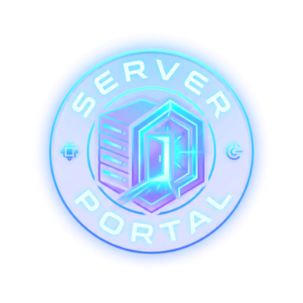

<div align="center">



# Server Portal

Self-hosted management and analytics portal for **Plex** and **Jellyfin**.

Node.js · Express · React · Tailwind · Docker

</div>

---

Invite members, manage access expiry, browse/request media through Seerr/Jellyseerr (without exposing Seerr UI), watch live sessions, and ship personalized wrap-ups — from one portal.

## Quick start (Docker)

```bash
git clone <this-repo>
cd Server-Manager-Portal
cp .env.example .env
# set JWT_SECRET to at least 32 random characters

docker compose up -d --build
```

Open **http://localhost:2121** and finish the setup wizard.

Persist data with the Compose mounts:

- `./config` → settings, users, caches
- `./backup` → rolling backups

More detail: **[docs/deployment.md](docs/deployment.md)** · **[docs/configuration.md](docs/configuration.md)**

## Features (short)

- **Member home** — wrap-up analytics, week calendar, recently/most watched, recently added
- **Discover** — live activity, trending, community picks
- **Requests** — embedded Seerr/Jellyseerr browse + request flow; optional membership sync
- **Calendar** — Sonarr/Radarr release calendar and download activity
- **Admin** — users, invites/referrals, live streams, kill rules, status page, backups
- **Auth** — Plex OAuth or Jellyfin login / Quick Connect

## Documentation

| Doc | |
|---|---|
| [Deployment](docs/deployment.md) | Compose, images, reverse proxy, networking |
| [Configuration](docs/configuration.md) | Env vars + Settings UI map |
| [Development](docs/development.md) | Local setup, scripts, tests |
| [Architecture](docs/architecture.md) | How the app is wired |
| [lib/ README](lib/README.md) | Backend domain folders |

## Local development

```bash
cp .env.example .env   # set JWT_SECRET
npm ci
npm run check          # build + typecheck + tests
npm start
```

See **[docs/development.md](docs/development.md)**.

## Project layout

```
.
├── index.js / index.tsx   # Server + React entries
├── client/                # React UI
├── lib/                   # Backend by domain (auth, users, plex, request-app, …)
├── tests/                 # Mirrors lib domains
├── docs/                  # Deployment & contributor docs
├── scripts/               # Build / local container helpers
├── static/                # Built assets + logos
├── Dockerfile
├── docker-compose.yml
└── .env.example
```

## License

MIT — see [LICENSE](LICENSE).
